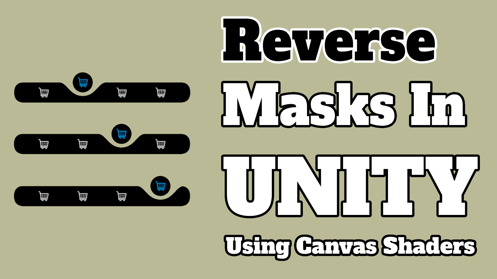

# Reverse Mask Menu

> A Unity tutorial project demonstrating reverse mask UI techniques for creative menu designs.

---

## Screenshots



---

## Overview

This project demonstrates advanced UI masking techniques in Unity, specifically using reverse masks to create sophisticated and visually interesting menu designs. Learn how to break away from standard rectangular UI elements and create organic, stylized interfaces.

---

## What Are Reverse Masks?

In Unity's UI system, masks normally hide content outside their bounds. A **reverse mask** inverts this behavior:
- **Normal mask** — Shows content inside, hides outside
- **Reverse mask** — Hides content inside, shows outside

This creates unique visual effects by inverting the typical masking logic.

---

## Features Demonstrated

- **Reverse mask implementation** — Custom UI masking technique
- **Complex UI shapes** — Non-rectangular menu elements
- **Smooth transitions** — Animated mask reveals
- **Performance optimization** — Efficient masking approaches
- **Layered UI** — Multiple masks working together
- **Creative menu design** — Stylized interface elements

---

## Applications

### Menu Designs
- Circular progress indicators
- Donut-shaped status displays
- Hollow center reveals
- Custom button shapes

### Visual Effects
- Spotlight effects
- Vignette overlays
- Circular aperture reveals
- Shaped windows into content

### Game UI
- Health/stamina rings
- Radar displays
- Targeting reticles
- Character portraits with custom shapes

---

## How Reverse Masks Work

### Implementation Steps

1. **Create a mask GameObject**
   ```
   - Image component (defines mask shape)
   - Mask component (with "Show Mask Graphics" enabled)
   ```

2. **Invert the mask logic**
   - Modify shader or canvas group properties
   - Invert alpha calculations
   - Test on target platform

3. **Add content to mask**
   - Place UI elements as children
   - Content shows only in inverted region
   - Layer multiple masks for complex effects

### Shader Approach

Create custom shader:
```glsl
// Invert mask logic
if (mask_alpha > 0.5) {
    discard;  // Hide inside mask
} else {
    // Show outside
}
```

---

## Getting Started

### Requirements

- **Unity 2020.3 LTS** or later
- **2D UI experience** helpful but not required
- Basic understanding of UI Canvas and Rect Transforms

### Setup

1. Clone repository: `git clone https://github.com/s4lt3d/ReverseMaskMenu.git`
2. Open in Unity
3. Load `Assets/Scenes/MainScene.unity`
4. Examine the scene hierarchy
5. Study the mask implementation

---

## Tutorial Walkthrough

Watch the complete tutorial: [YouTube Video](https://youtu.be/zuNQepiPU2k)

The tutorial covers:
1. **Basic masking** — Standard Unity mask behavior
2. **Reverse mask setup** — Creating inverted masks
3. **Implementing shaders** — Custom mask shaders
4. **Animation** — Animating mask reveals
5. **Performance tips** — Optimizing for mobile
6. **Real-world examples** — Using in game menus

---

## Project Structure

```
Assets/
├── Scenes/
│   └── MainScene.unity       — Main demonstration scene
├── Scripts/
│   ├── ReverseMask.cs        — Custom mask component
│   ├── MaskAnimator.cs       — Animation controller
│   └── UIManager.cs          — UI state management
├── Shaders/
│   └── ReverseMask.shader    — Custom masking shader
├── Materials/
│   └── ReverseMaskMat.mat    — Mask material
├── UI/
│   └── Layouts/              — UI prefabs and layouts
└── README.md
```

---

## Custom Shader

The key to reverse masking is the shader:

```hlsl
// Simplified reverse mask shader
float mask = tex2D(_MaskTex, uv).a;

// Invert the mask
if (mask > 0.5) {
    discard;  // Hide pixels inside mask
} else {
    // Show pixels outside mask
}
```

---

## Advanced Techniques

### Multiple Layers
Stack multiple reverse masks:
- Outer mask creates outer boundary
- Inner mask creates inner cutout
- Combine for donut/ring effect

### Smooth Transitions
Animate mask properties:
- Fade in/out with alpha
- Move mask position
- Scale mask shape
- Rotate for effects

### Performance Optimization
- Use single mask when possible
- Minimize overdraw
- Batch masked UI elements
- Cache mask calculations

---

## Tips & Best Practices

### Design
- Keep masks simple for performance
- Plan layering strategy
- Test on target devices
- Use masks sparingly for visual impact

### Performance
- Combine masks where possible
- Avoid real-time updates when static works
- Use texture atlasing
- Profile on actual devices

### Debugging
- Visualize mask boundaries
- Check shader compilation
- Verify layer ordering
- Test on different screen sizes

---

## Troubleshooting

### Mask Not Working
- Verify Image component is on same object
- Check canvas render mode
- Ensure mask is enabled
- Verify material uses correct shader

### Unexpected Visibility
- Check mask alpha/transparency
- Verify layer sorting order
- Test shader math
- Review mask bounds

### Performance Issues
- Reduce mask count
- Simplify mask textures
- Use lower resolution masks
- Profile with profiler window

---

## Community

Share your reverse mask designs:
- Post on game dev forums
- Share screenshots online
- Contribute improvements
- Help other developers

---

## Related Resources

- [Unity UI Documentation](https://docs.unity3d.com/Packages/com.unity.ugui@latest/)
- [Shader Graph Guide](https://docs.unity3d.com/Packages/com.unity.shadergraph@latest/)
- Other UI tutorials in the repository

---

## License

Copyright © Walter Gordy

---

## Tutorial

[Watch the full tutorial on YouTube](https://youtu.be/zuNQepiPU2k)
